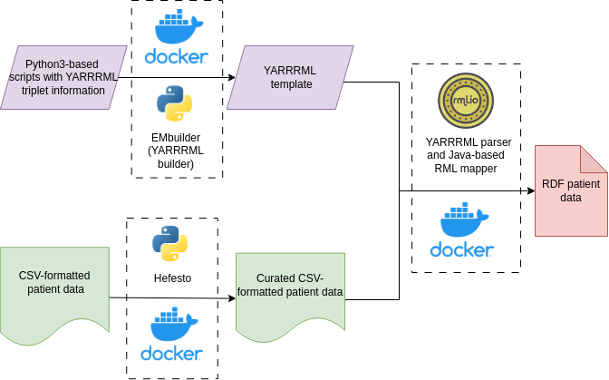

# Common Data Element semantic model implementation 

[Common Data Element Semantic Model](https://github.com/ejp-rd-vp/CDE-semantic-model) defines a set of clinical data elements used in the healthcare domain of knowledge. However, it doesn't specify a way for implementing it. There's several ways to implement this CDE semantic model, from the European Joint Project for Rare Diseases (EJPRD) we propose an implementation workflow.


<p align="center"> 
	 
	<p align="center">Figure 1: Common data element overall worflow </p> 

</p> 

This implementation consumes a CSV-based data table that contains patient data under a certain glossary that defines the data template. Also, consumes a YARRRML template that references each one of the data requirements and defines the RDF shape based on the CDE semantic model. Both artifacts are the requirement to perform an RDF transformation tool to obtain functional RDF-based data.

[YARRRML](https://rml.io/yarrrml/spec/) is not an easy language for creating and maintaining complex triplets patterns, that's why we have created a YARRRML builder that consumes a Python script with all information required to generate a fully functional [YARRRML file](/CDE_version_2.0.0/YARRRML/CDE_yarrrml_template.yaml). Also all information related to our **YARRRML template builder** is located [here](/CDE_version_2.0.0/YARRRML/README.md).

Due to having some YARRRML limitations to define certain references in template and the need of a quality control step at data level before perfoming the data transformation. We have created a Python3-based module (Hefesto) to cover some data curation and adaptation for this workflow. Documentation for all **CSV data requirements** needed to generate each data element, please go [here](/CDE_version_2.0.0/CSV_docs/).

We have created a Dockerized Ruby-based web service that contains YARRRML2RML parser and a RDF transformation tool named RDFizer that performs the transformation to RDF.

All these elements, properly Dockerized to work as a workflow, have been mounted into our [FAIR-in-a-box](https://github.com/ejp-rd-vp/FiaB) interface that controls all this patient data transformation using the version 2 of the Common Data Element Semantic model.

### [YARRRML template](/CDE_version_2.0.0/YARRRML/)

Have a look at `YARRRML` folder to know more about the YARRRML builder and the resulting YARRRML templates.

### [CSV documentation](/CDE_version_2.0.0/CSV_docs/)

Check the folder named `CSV_docs` to obtain some exemplar data (before and after our curation step) and also, a glossary to populate your CSV properly to generate CDE-based patient data.

## Implementation without using FAIR-in-a-box

Despite the whole implementation is ready using [FAIR-in-a-box](https://github.com/ejp-rd-vp/FiaB) interface, you have the option to perform RDF transformations locally, without relying on the FAIR-in-a-box toolkit. To support this process, we have developed Docker compose images that cover the entire transformation pipeline.

### YARRRML and CSV preparation:

First, create your YARRRML template using a YARRRML template builder or select the appropriate YARRRML template. Save the template as {TAGNAME}_yarrrml_template.yaml and place it in the ./config folder, for example, "height_yarrrml_template.yaml".

In the ./data folder, create a CSV file with the required headings for your desired transformation, following the guidelines provided in the accompanying documentation. Save the file as {TAGNAME}.csv, e.g., "height.csv".

1) **Folder distribution:**
```bash
.
./data/   (this folder is mounted into sdmrdfizer - see step 1 below)
./data/mydataX.csv  (input csv files)
./data/mydataY.csv...
./data/triples/  (output FAIR data ends up here)
./config/
./config/{TAGNAME}_yarrrml_template.yaml ({TAGNAME} is a one-word tag of the "type" of data, e.g. "height")
```

The {TAGNAME} serves as a coordinating identifier among various components during the automation steps and must precisely match the "tag" portion of the template name.


2) **Gems and Docker images preparation:**

```bash
bundle install
gem build   
gem install yarrrml_template_builder-{VERSION}.gem
```

Here, the VERSION refers to a specific version that will appear in the filename of the gem.

3) **RDF transformation execution:**


Ensure that the `sdmrdfizer_ejp` and `yarrrml-parser-ejp` services are running, with the ./data folder mounted as /data and ./config folder mounted as /config. You can use Docker Compose to run both services:

```yaml
version: "3.0"
services:

    yarrrml_transform:
        image: markw/yarrrml-parser-ejp:latest
        container_name: yarrrml_transform
        ports:
            - "3000:3000"
        volumes:
            - ./data:/data

    rdfizer:
        image: markw/sdmrdfizer_ejp:0.5.0
        container_name: rdfizer
        ports:
            - "4000:4000"
        volumes:
            - ./data:/data
            - ./config:/config

```
Once this services are running, utilize the [rdf_transform.rb](/CDE_version_2.0.0/misc/rdf_transform.rb) script, making sure to modify the `datatype_tag` parameter within the proper TAGNAME from your YARRRML and CSV files. RDF file should be created a `./data/triples` folder.